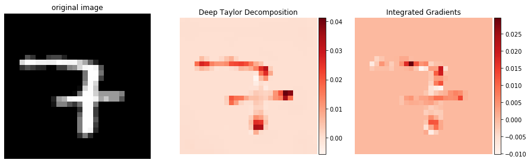
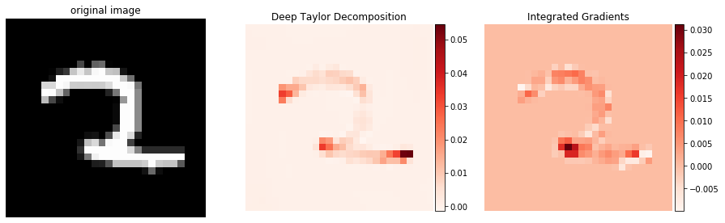

# Deep Taylor Decomposition and Integrated Gradients Tutorial

This is the repository for XAI tutorials of KAIST-LG Advanced AI course. This repository provides tutorial code for Deep Taylor Decomposition [1] and Integrated Gradients [2].

## Dependencies
- Python 3.7
- Tensorflow 1.14.0
- Tensorboard 1.2.0
- Numpy 1.18.1
- Matplotlib 3.1.3

## Usage
### Train
```bash
$ python main.py --train
```
### Test
```bash
$ python main.py --test
```
### Explanation
```bash
// Running Deep Taylor Decomposition
$ python main.py --explain --method dtd

// Running Integrated Gradients
$ python main.py --explain --method integrated
```

## Examples



## References
[1] Montavon, G., Lapuschkin, S., Binder, A., Samek, W., & Müller, K. R. (2017). Explaining nonlinear classification decisions with deep taylor decomposition. Pattern Recognition, 65, 211-222.

[2] Sundararajan, M., Taly, A., & Yan, Q. (2017). Axiomatic attribution for deep networks. arXiv preprint arXiv:1703.01365.